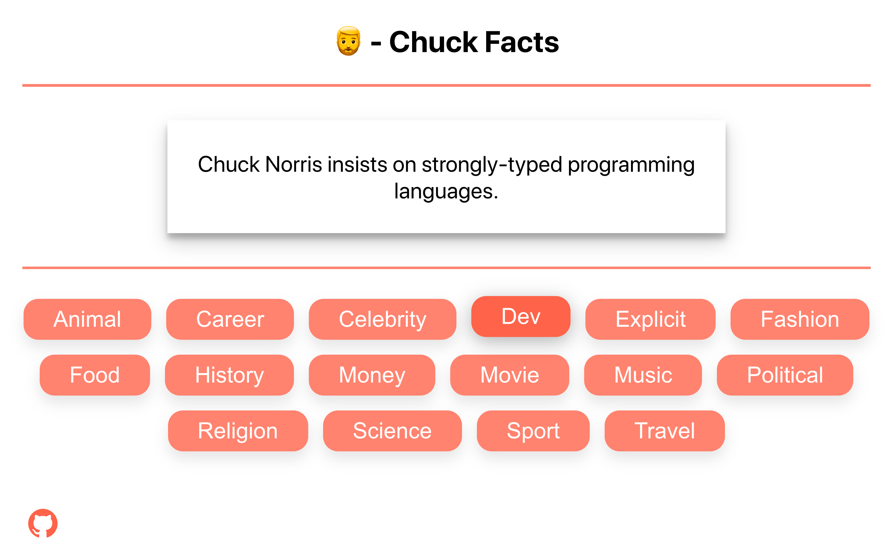

<!--
Thanks from Joe:
  - This README.md file came from the following repo:
  - https://github.com/othneildrew/Best-README-Template
-->

<!-- PROJECT LOGO -->
<br />
<p align="center">
    

  <p align="center">
    A Typescript SPA using React and Apollo Client on the front end & an Apollo server that wraps an <a href="https://api.chucknorris.io/" title="Chuck Norris API">existing REST API</a> with a GraphQL API. This project was completed as a Fullstack Engineer Test - it was quite involved and quite a bit of fun :)
    <br />
    <br />
    <a href="https://codesandbox.io/s/zealous-nightingale-qwcvd?file=/src/index.tsx">View Codesandbox</a>
    ·
    <span>Heroku server endpoint hosted <a href="https://chuck-graphql.herokuapp.com/graphql">Here</a>.</span>
  </p>
</p>


<!-- TABLE OF CONTENTS -->
## Table of Contents


* [Getting Started](#getting-started)
  * [Prerequisites](#prerequisites)
  * [Installation](#installation)
* [Built With](#built-with)
* [Project Outline](#project-outline)
    * [Tasks](#tasks)
    * [Requirements](#requirements)
    * [Bonuses](#bonuses)
* [Contact](#contact)


<!-- GETTING STARTED -->
## Getting Started

You can follow these steps to run the project locally or <a href="https://codesandbox.io/s/zealous-nightingale-qwcvd?file=/src/index.tsx">view it live now!</a>

### Prerequisites

npm and Node are required for running the project on your machine. Install the latest version of npm.
* npm
```sh
npm install npm@latest -g
```
Check for your version of Node. Find the LTS at <a href="https://nodejs.org/en/">https://nodejs.org/</a>.
```sh
node --version
```

### Installation

1. Clone the repo and `cd` into the directory
```sh
git clone https://github.com/joematune/repobot-test
cd repobot-test
```
2. Install both client and server packages with the following two commands.
```sh
npm install
npm --prefix ./server install ./server
```
3. Run both the client and server. NOTE: Don't run `npm start` as it won't start your API server
```sh
npm run dev
```


## Built With
The following are the key tools and frameworks used in this project.
* [React](https://reactjs.org/)
* [TypeScript](https://www.typescriptlang.org/)
* [GraphQL](https://graphql.org/)
* [Node](https://nodejs.org/en/)
* [Apollo Server & Client](https://www.apollographql.com/)


## Project Outline

  ### Tasks
  - [x] You should develop an Apollo GraphQL API
  - [x] Your GraphQL API should wrap the ChuckNorris.io API
  - [x] Your GraphQL API should have a Query type that resolve all Categories (https://api.chucknorris.io/jokes/categories)
  - [x] Your GraphQL API should have a Query type that resolves a random joke given a Category as an argument (https://api.chucknorris.io/jokes/random?category={category})
  
  - [x] You should develop a Single Page Apllication (SPA)
  - [x] Your SPA should consume the above GraphQL API
  - [x] Your SPA should have a home page with a list of categories
  - [x] When a category is clicked, the category detail(a random joke) should be displayed appropriately
  
  ### Requirements
  - [x] TypeScript
  - [x] React
  - [x] Apollo Client
  - [x] Apollo Server
  - [x] NodeJS
  - [x] Centralized state management (Redux/Context API) any state management framework/tool can be used: <a href="https://react-tracked.js.org/">React-Tracked</a>
  - [x] Your centralised store must be immutable and make use of the Action/Reducer pattern
  - [x] Your solution should be checked into a public Github repo. Additionally the README should outline all the necessary steps required to bootstrap  the code
  - [x] Your solution can be implemented in CodeSandbox or similar: <a href="https://codesandbox.io/s/zealous-nightingale-qwcvd?file=/src/index.tsx">Chuck Facts</a>

  ### Bonuses
  :nerd_face:
  - [x] Git
  - [x] New React things: Hooks
  - [x] Tests
  - [x] Responsiveness
  - [x] CSS-in-JS (Styled-Components)
  - [x] Go above and beyond
  - [x] TypeScript


<!-- CONTACT -->
## Contact

Joe Matune - [@joematune](https://twitter.com/joematune)
